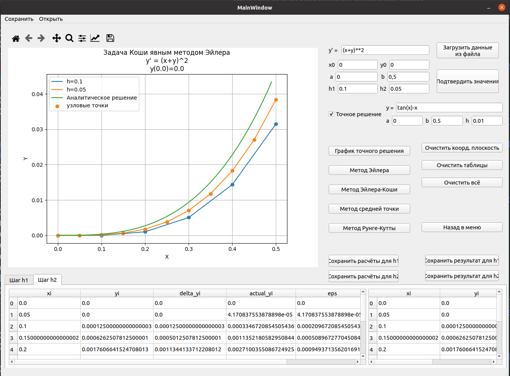

# DifferentialEquations
Numerical solutions of differential equations: Eulers, Euler-Cauchy, Runge-Kutta, midpoint method


## Screenshots

### Differential equations window



## PyQt5 installation
```
pip3 install --user pyqt5  
sudo apt-get install python3-pyqt5  
sudo apt-get install pyqt5-dev-tools
sudo apt-get install qttools5-dev-tools
```

## Run App
```
git clone https://github.com/ashnaider/DifferentialEquations.git

cd DifferentialEquations/

python3 main.py
```
